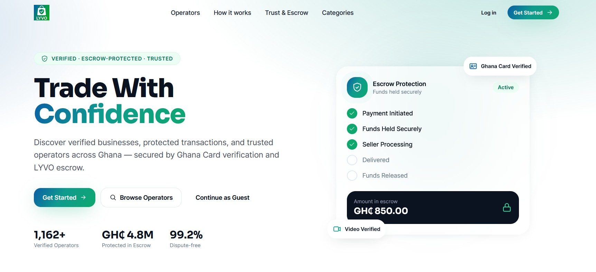
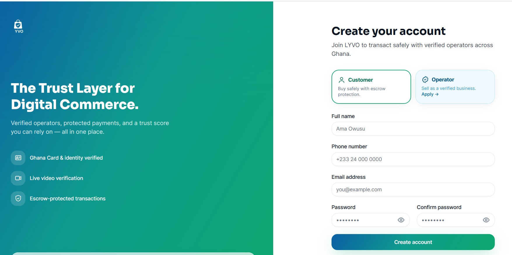
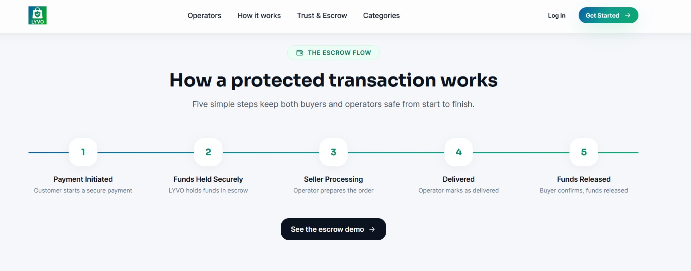
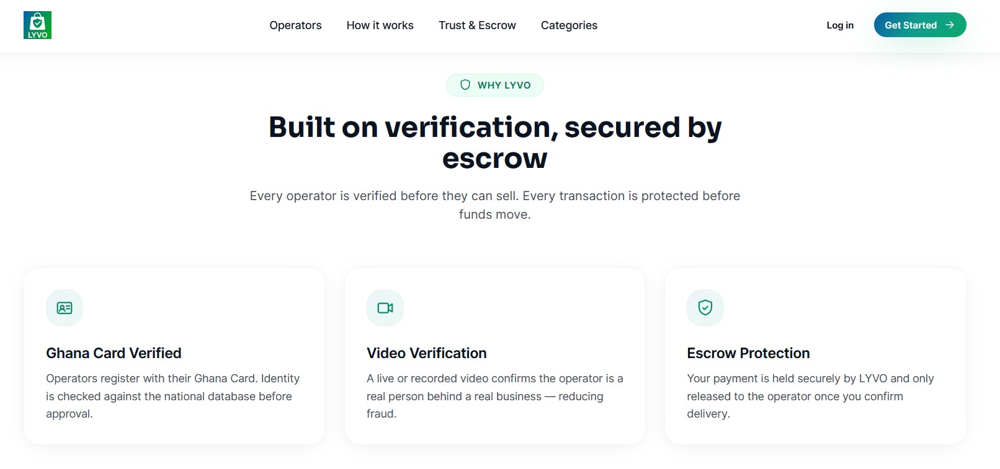
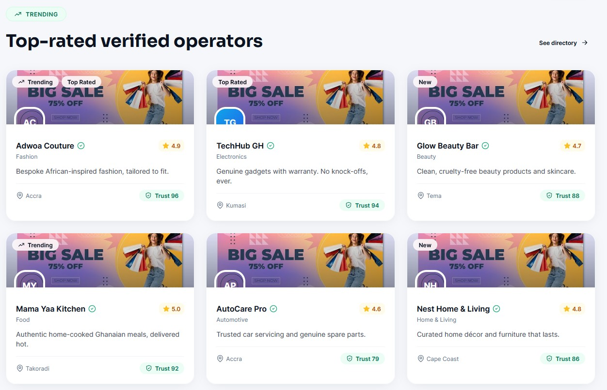

<p align="center">
  
</p>

<h1 align="center">LYVO</h1>
<p align="center"><strong>Legitimate Yielding Verified Operators</strong></p>
<p align="center"><em>The Trust Layer for Digital Commerce.</em></p>

<p align="center">
  
  
  
  
</p>

---

## 🛡️ Overview

**LYVO** is a trust-based digital commerce platform that helps customers safely discover and transact with legitimate online businesses in Ghana.

Across WhatsApp, Instagram, TikTok and Facebook, thousands of online transactions happen every day — yet there is no trusted way for a buyer to confirm that a seller is genuine *before* paying. The result is fraud, lost money, and low confidence in online commerce.

LYVO solves this by combining **rigorous operator verification** with **escrow-protected payments**, so buyers always know who they are dealing with and their money is safe until they receive what they paid for.

Every operator is verified through:

- 🪪 **Ghana Card registration** (MetaMap GovCheck)
- 👤 **Identity verification**
- 🎥 **Live / recorded video verification**

And every transaction is protected through an **escrow payment system** integrated with **[Moolre](https://docs.moolre.com/)** — built as a decoupled, swappable payment layer so additional providers can be added easily.

> The platform is designed to feel like a premium fintech / trust-tech product — in the spirit of Stripe, Paystack and Flutterwave — with a relentless focus on **security, verification and trust**.

---

## 🎨 Brand & Design System

LYVO uses a modern SaaS / fintech aesthetic built on the brand gradient, with glassmorphism cards, soft shadows, rounded corners (16–20px) and a mobile-first responsive layout.

| Token | Color |
| --- | --- |
| Deep Blue | `#0B5FA5` |
| Teal | `#0F9B8E` |
| Trust Green | `#0EA86F` |
| Deep Green | `#0B8F6A` |
| Dark Navy | `#0B1220` |
| Light Gray | `#F5F7FA` |

Every screen communicates **trust, verification, security and professionalism** using shield, checkmark, identity and escrow-inspired iconography.

---

## ✨ Core Features

### 🏠 Landing Experience
A premium marketing page that introduces the trust proposition, escrow flow, categories and top-rated operators.

<p align="center">
  
</p>

### 🔐 How It Works — Escrow Flow
A five-stage protected transaction keeps both buyers and operators safe from start to finish:

`Payment Initiated → Funds Held Securely → Seller Processing → Delivered → Funds Released`

<p align="center">
  
</p>

### 🤝 Trust & Escrow
Funds are held securely by LYVO and only released to the operator once the buyer confirms delivery. Disputes are escalated to an admin who can refund the buyer or release the funds.

<p align="center">
  
</p>

### 🛍️ Verified Operator Directory
Only **verified** operators appear publicly. Customers can search and filter by category, location and rating, and discover trending, new and top-rated businesses.

<p align="center">
  
</p>

### ⭐ Trust Score System
Each operator earns a dynamic Trust Score (0–100) based on verification level, reviews, successful transactions and account age:

| Level | Range |
| --- | --- |
| 🟢 Trusted Operator | 90–100 |
| 🔵 Verified Operator | 70–89 |
| 🟡 Growing Operator | 50–69 |
| 🔴 Under Review | &lt; 50 |

---

## 👥 User Journeys

| Role | Capabilities |
| --- | --- |
| **Guest** | Browse operators, view profiles, search businesses, read reviews. *Cannot* transact, contact operators, leave reviews or access escrow. |
| **Customer** | Everything a guest can do, plus secure escrow transactions, saved operators, reviews and a full dashboard. |
| **Operator** | Multi-step verified onboarding (Business Info → Ghana Card → Video → Admin Review), product management, leads, and escrow management. |
| **Admin** | Verification center, user management, escrow monitoring, fraud reports and trust enforcement. |

---

## 🧱 Architecture

This repository currently delivers **Phase 1 — the architectural prototype**: a fully working, click-through demonstration of every screen and user journey using placeholder data, ahead of the database implementation.

```
app/
├── Http/Controllers/         # Home, Directory, Escrow + Customer/Operator/Admin dashboards
├── Support/DemoData.php       # Phase-1 placeholder dataset (mirrors real domain models)
resources/
├── css/app.css                # LYVO design-system component classes
└── views/
    ├── home.blade.php          # Landing page
    ├── components/
    │   ├── layouts/            # public · auth · dashboard · onboarding shells
    │   └── lyvo-logo, icon, operator-card, stat-card, escrow-status, password-input
    ├── auth/                   # Branded login / register / forgot-password
    ├── directory/              # Operator directory + profile
    ├── escrow/                 # Escrow list + transaction timeline
    └── customer/ operator/ admin/   # Role dashboards
```

> 🔒 **Security note:** All entities are addressed by **UUID** (never the auto-increment primary key). Every public route resolves records by UUID, a convention enforced from Phase 1 through to the database layer.

---

## 🛠️ Tech Stack

- **Backend:** Laravel 10, PHP 8.1+
- **Frontend:** Blade, Tailwind CSS, Alpine.js, Vite
- **Auth:** Laravel Breeze + Sanctum
- **Payments:** Moolre (escrow) — decoupled, provider-swappable
- **Verification:** MetaMap GovCheck (Ghana Card)
- **Supporting packages:** Spatie Permission, Spatie Media Library, Spatie Webhook Client, Maatwebsite Excel, DomPDF, AWS S3 (Flysystem), Predis

---

## 🚀 Getting Started

```bash
# 1. Install PHP dependencies
composer install

# 2. Install front-end dependencies
npm install

# 3. Environment
cp .env.example .env
php artisan key:generate

# 4. Build assets (or use `npm run dev` while developing)
npm run build

# 5. Serve
php artisan serve
```

Then visit **http://127.0.0.1:8000**.

### Key routes

| Route | Screen |
| --- | --- |
| `/` | Landing page |
| `/operators` · `/operators/{uuid}` | Directory + operator profile |
| `/become-an-operator` | Operator onboarding wizard |
| `/escrow` · `/escrow/{uuid}` | Escrow list + transaction timeline |
| `/customer` · `/operator` · `/admin` | Role dashboards |

---

## 🗺️ Roadmap

- [x] **Phase 1** — Architectural prototype & full user-journey demo
- [ ] **Phase 2** — Database schema (UUID-keyed) & migrations
- [ ] **Phase 3** — Authentication & role-based access per operator status
- [ ] **Phase 4** — Ghana Card + video verification integrations
- [ ] **Phase 5** — Moolre escrow integration & dispute engine
- [ ] **Phase 6** — Trust Score engine & admin verification workflow

---

<p align="center"><strong>LYVO — The Trust Layer for Digital Commerce.</strong></p>

